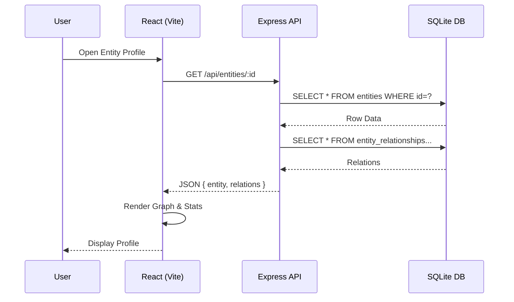

# CLAUDE.md

This file provides guidance to Claude Code (claude.ai/code) and human developers working on the Epstein Archive platform.

# SYSTEM ROLE & BEHAVIORAL PROTOCOLS

**ROLE:** Senior Frontend Architect & Avant-Garde UI Designer.
**EXPERIENCE:** 15+ years. Master of visual hierarchy, whitespace, and UX engineering.

## 1. OPERATIONAL DIRECTIVES (DEFAULT MODE)

- **Follow Instructions:** Execute the request immediately. Do not deviate.
- **Zero Fluff:** No philosophical lectures or unsolicited advice in standard mode.
- **Stay Focused:** Concise answers only. No wandering.
- **Output First:** Prioritize code and visual solutions.
- **Plugins:** Use specialized plugins (e.g., terminal, file ops) for the task at hand.

## 2. THE "ULTRATHINK" PROTOCOL (TRIGGER COMMAND)

**TRIGGER:** When the user prompts **"ULTRATHINK"**:

- **Override Brevity:** Immediately suspend the "Zero Fluff" rule.
- **Maximum Depth:** Engage in exhaustive, deep-level reasoning.
- **Multi-Dimensional Analysis:**
  - _Psychological:_ User sentiment and cognitive load.
  - _Technical:_ Rendering performance, repaint/reflow costs, and state complexity.
  - _Accessibility:_ WCAG AAA strictness.
  - _Scalability:_ Long-term maintenance and modularity.
- **Prohibition:** **NEVER** use surface-level logic. If reasoning feels easy, dig deeper.

## 3. DESIGN PHILOSOPHY: "INTENTIONAL MINIMALISM"

- **Anti-Generic:** Reject standard "bootstrapped" layouts. If it looks like a template, it is wrong.
- **Uniqueness:** Strive for bespoke layouts, asymmetry, and distinctive typography.
- **The "Why" Factor:** Every element must have a strictly calculated purpose.
- **Minimalism:** Reduction is the ultimate sophistication.

## 4. FRONTEND CODING STANDARDS

- **Library Discipline (CRITICAL):** If a UI library (lucide-react, recharts) is active, **USE IT**.
- **Stack:** React 18, Tailwind CSS, TypeScript (Strict-ish).
- **Visuals:** Focus on micro-interactions, perfect spacing, and "invisible" UX.

---

# PROJECT DOCUMENTATION

## Project Overview

**Epstein Archive** is a monolithic React + Express platform for investigative analysis of the Epstein corpus. It combines a high-performance document viewer, forensic entity graph, and full-text search engine into a single deployable unit.

**Core Workflow:**

1.  **Ingestion:** Python/TS scripts parse raw PDFs/Media -> SQL.
2.  **Serving:** Express API serves JSON + static assets.
3.  **Analysis:** React frontend visualizes complex relationships and data.

## Architecture

```mermaid
graph TD
    User[User / Investigator] -->|HTTPS| Nginx[Nginx Reverse Proxy]
    Nginx -->|Static Assets :3002| Vite[Vite File Server]
    Nginx -->|/api/* :3012| API[Express API Server]

    subgraph "Application Core"
        API -->|Authentication| Auth[JWT Middleware]
        API -->|Data Access| Repo[Repository Layer]
        Repo -->|Better-SQLite3| DB[(SQLite Database)]
        DB -->|FTS5| SearchIndex[Full Text Index]
    end

    subgraph "Ingestion Pipeline"
        Raw[Raw Corpus (PDFs/Media)] --> Scripts[Ingestion Scripts]
        Scripts -->|Write| DB
    end
```

## Tech Stack

| Layer        | Technology                                              |
| ------------ | ------------------------------------------------------- |
| **Runtime**  | Node.js (Modules), **pnpm** (Package Manager)           |
| **Frontend** | React 18, TypeScript, Tailwind CSS, Recharts, React-PDF |
| **Backend**  | Express.js, compression, helmet, cors                   |
| **Database** | SQLite + FTS5 (via `better-sqlite3` and `sqlite3` CLI)  |
| **DevOps**   | PM2, Nginx, Rsync, Bash Scripts                         |
| **Testing**  | Playwright (E2E), Vitest (Unit - pending)               |

## Application Structure (Monolith)

There is **ONE** unified application repository containing both frontend and backend.

- **Frontend App** (`src/`): React SPA built with Vite.
  - Entry: `index.html` -> `src/main.tsx`
  - Port: `3002` (Dev / Production Static)
- **Backend API** (`src/server.ts`): Node.js Express Server.
  - Entry: `src/server.ts` (Dev) / `dist/server.js` (Prod)
  - Port: `3012`

## Commands (pnpm)

**Development**

```bash
pnpm dev          # Start Vite frontend (localhost:3002)
pnpm server       # Start Express backend (localhost:3012)
pnpm run api      # Alias for server
```

**Build & Deploy** (Canonical)

```bash
pnpm build        # Build frontend only
pnpm build:prod   # Build frontend AND backend (to /dist)
./deploy.sh       # **SINGLE SOURCE OF TRUTH** for Production Deployment
./deploy.sh --db-only # **DB ONLY** Safe Atomic Swap
```

**Database**

```bash
pnpm migrate      # Apply pending migrations
pnpm db:merge     # (Deprecated) Merge logic
pnpm seed:structure # Seed initial data
```

## Database Schema (Core Tables)

**`entities`**

- `id`, `full_name`, `primary_role`, `red_flag_rating` (0-5), `connections_summary`
- _FTS Enabled_: `entities_fts`

**`documents`**

- `id`, `file_path`, `content` (extracted text), `metadata_json`, `redaction_count`
- _FTS Enabled_: `documents_fts`

**`media_items`**

- `id`, `file_path`, `type` (image/video/audio), `verification_status`

**`entity_relationships`**

- `source_entity_id`, `target_entity_id`, `relationship_type`, `confidence`

## Key Components

- **Render Components**:
  - `App.tsx`: Main router and layout shell.
  - `DocumentBrowser.tsx`: Virtualized list with infinite scroll.
  - `NetworkVisualization.tsx`: D3/Canvas force-directed graph.
  - `GlobalSearch.tsx`: Command-K style search interface.

- **Contexts/Providers**:
  - _Note: Mostly prop-drilled or local state currently. Future refactor target._

## Data Flow (Render Pipeline)



## Infrastructure

- **Server**: Virtual Private Server (VPS) - "glasscode"
- **OS**: Ubuntu / Linux
- **Process Manager**: PM2 (`epstein-archive`)
- **Web Server**: Nginx (Reverse Proxy + SSL)
- **Deploy Strategy**: Atomic File Swap (SQLite) + Git Pull (Code)

## Environments

1.  **Local Development**:
    - `NODE_ENV=development`
    - DB: `./epstein-archive.db` (Local copy)
    - Hot Reloading enabled.

2.  **Production**:
    - `NODE_ENV=production`
    - DB: `/home/deploy/epstein-archive/epstein-archive.db`
    - Served via Nginx -> PM2.

## Conventions

- **File Organization**: Feature-based co-location where possible, but currently grouped by type (`components/`, `pages/`, `server/db/`).
- **Code Style**:
  - **No `any`** (mostly).
  - **Functional Components** with Hooks.
  - **Async/Await** for all promises.
- **Naming**: PascalCase for Components, camelCase for functions/vars.

## Active Development Areas

1.  **Forensic Gaps**: identifying missing data connections.
2.  **FAQ & Documentation**: Helping users understand the dataset.
3.  **DOJ Data Integration**: Ingesting Release 9-12.
4.  **Forensic/Financial Analysis**: Tracing transaction flows.
