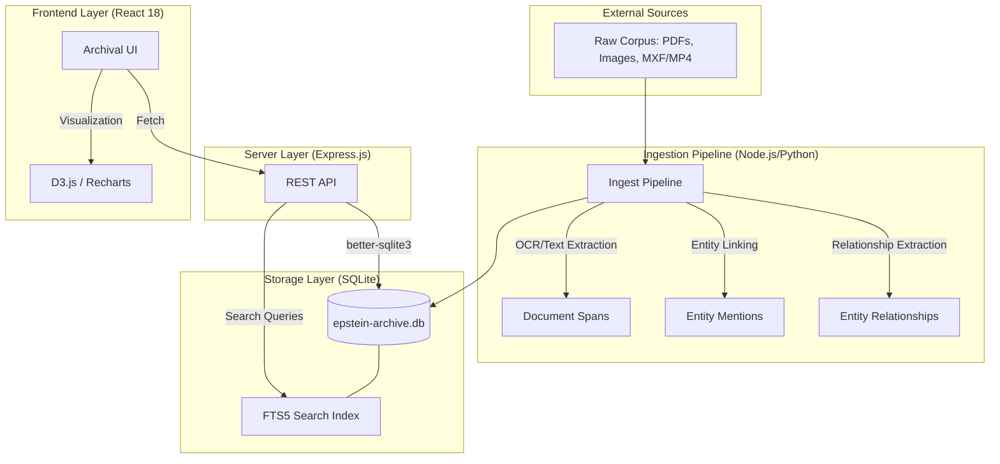
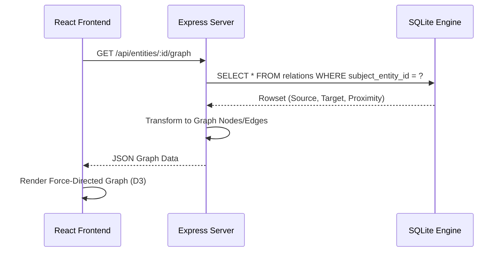

# Epstein Archive Technical Overview

This document provides a high-level technical map of the Epstein Archive platform, detailing the data flow from raw corpus ingestion to frontend visualization.

## 1. System Architecture

The system is a monolith designed for high-performance forensic analysis of a large SQLite-backed dataset.

## 2. Core Data Flow

### 2.1 Ingestion & Intelligence

The pipeline operates in stages to transform unstructured PDFs into a queryable graph:

1. **Extraction**: `ffmpeg` and `tesseract` extract frames, text, and metadata.
2. **Analysis**: NLP models (scripts/ingest_intelligence.ts) identify entities and classify relationships.
3. **Indexing**: Data is written to `entities`, `documents`, and `entity_relationships`.
4. **FTS Update**: Triggers automatically sync the content to `documents_fts` and `entities_fts` for sub-millisecond searching.

### 2.2 Relationship Graph Logic

The "Forensic Entity Graph" uses a weighted proximity model:

- **Proximity Score**: Determined by the frequency and significance of co-mentions.
- **Strength/Weight**: Legacy terms for the canonical `proximity_score` column.
- **Confidence**: A probability score (0-1) reflecting the reliability of the extraction.

## 3. Database Schema Highlights

| Table                  | Purpose               | Key Columns                                               |
| ---------------------- | --------------------- | --------------------------------------------------------- |
| `entities`             | Canonical people/orgs | `full_name`, `red_flag_rating`, `mentions`                |
| `documents`            | Source materials      | `file_path`, `content`, `evidence_type`                   |
| `entity_relationships` | Graph edges           | `source_entity_id`, `target_entity_id`, `proximity_score` |
| `media_items`          | Visual evidence       | `file_path`, `is_sensitive`, `album_id`                   |

## 4. Deployment Environment

- **Host**: Linode/VPS ("glasscode")
- **Serving**: PM2 manager -> Express API (:3012) -> Vite Assets (:3002)
- **Proxy**: Nginx handling SSL and routing.
- **Storage**: Block storage for the master `.db` file.

> [!NOTE]
> Database migrations are handled via `scripts/migrations/`. Always verify local integrity with `PRAGMA integrity_check;` before any deployment.
