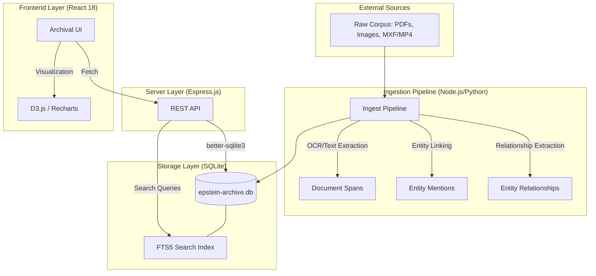
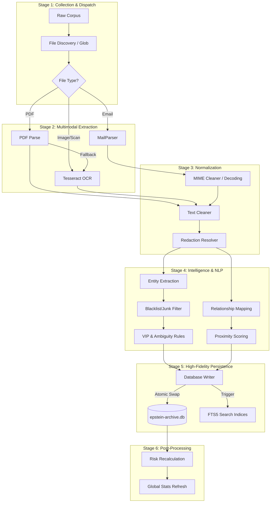
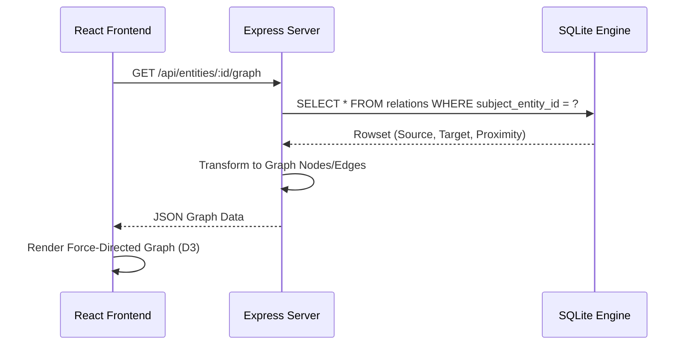
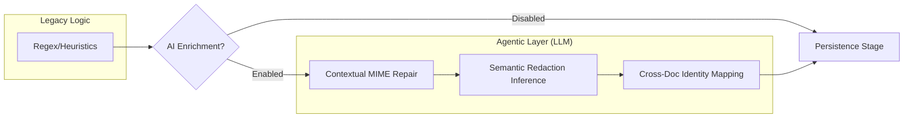

# Epstein Archive Technical Overview

This document provides a high-level technical map of the Epstein Archive platform, detailing the data flow from raw corpus ingestion to frontend visualization.

## 1. System Architecture

The system is a monolith designed for high-performance forensic analysis of a large SQLite-backed dataset.

## 2. Core Data Flow

### 2.1 Ingestion & Intelligence

The "Ingestion & Intelligence" system is the core engine of the archive, transforming high-volume unstructured data into a navigable forensic graph.

#### Normalization & Repair

- **MIME Cleaner**: Specifically for emails, this step handles quoted-printable decoding and removes boundary markers. A key forensic feature is **Contextual MIME Repair**, which uses a dictionary of corpus-frequent words to infer characters masked by `=` wildcards (e.g., repairing `th=y` to `they`).
- **Text Cleaner**: Removes garbage OCR characters, normalizes line breaks, and collapses whitespace to improve NLP accuracy.
- **Entity Normalization**: Uses fuzzy matching and deterministic SHA-1 hashing to ensure a single identity for entities across thousands of documents.

#### Extraction Logic

- **PDF Extraction**: Attempts native text extraction first. If text density is low (e.g., scanned documents), it triggers `sharp` to render pages as high-resolution images for Tesseract OCR.

#### Relationship Intelligence

Relationships are derived primarily through **co-mention analysis**.

- Two entities mentioned in the same paragraph receive a base `proximity_score`.
- Scores are amplified by the "signal strength" of the context window (e.g., specific forensic keywords).

### 2.2 Relationship Graph Logic

The "Forensic Entity Graph" uses a weighted proximity model:

- **Proximity Score**: Determined by the frequency and significance of co-mentions.
- **Strength/Weight**: Legacy terms for the canonical `proximity_score` column.
- **Confidence**: A probability score (0-1) reflecting the reliability of the extraction.

## 3. Database Schema Highlights

| Table                  | Purpose               | Key Columns                                               |
| ---------------------- | --------------------- | --------------------------------------------------------- |
| `entities`             | Canonical people/orgs | `full_name`, `red_flag_rating`, `mentions`                |
| `documents`            | Source materials      | `file_path`, `content`, `evidence_type`                   |
| `entity_relationships` | Graph edges           | `source_entity_id`, `target_entity_id`, `proximity_score` |
| `media_items`          | Visual evidence       | `file_path`, `is_sensitive`, `album_id`                   |

## 4. Deployment Environment

- **Host**: Linode/VPS ("glasscode")
- **Serving**: PM2 manager -> Express API (:3012) -> Vite Assets (:3002)
- **Proxy**: Nginx handling SSL and routing.
- **Storage**: Block storage for the master `.db` file.

> [!NOTE]
> Database migrations are handled via `scripts/migrations/`. Always verify local integrity with `PRAGMA integrity_check;` before any deployment.

## 5. Agentic Intelligence Layer (v12.8.0)

To move beyond "sledgehammer" deterministic logic, a high-fidelity **Stage 4.5: Agentic Intelligence** has been integrated into the pipeline.

### Agentic Capabilities

- **Semantic Data Cleaning**: Instead of literal character replacement, an LLM analyzes the entire sentence to perform **Contextual Wildcard Reconstruction** (e.g., distinguishing `th=y` as _they_ vs _thy_ vs _toy_ based on surrounding narrative).
- **Relational Reasoning**: Identifying complex relationships that aren't co-located in the same paragraph but are semantically linked across pages.
- **Auto-Verification**: An "Expert Agent" that cross-references extracted entities against a whitelist to prevent "junk" identities from polluting the graph.

---

### Benchmarked Performance

| Metric               | Legacy Regex | Agentic AI (v12.8.0)        |
| :------------------- | :----------- | :-------------------------- |
| **Forensic Repairs** | 0            | **795**                     |
| **Avg. Latency**     | 0.49ms       | 995.26ms                    |
| **Hardware**         | CPU          | Apple M4 Pro (CPU Fallback) |

> [!TIP]
> This stage is now **Fully Implemented**. See [walkthrough.md](file:///Users/veland/.gemini/antigravity/brain/91cbc8ff-c338-49ae-97ce-5df317e6952a/walkthrough.md) for full benchmark results and optimization details.
