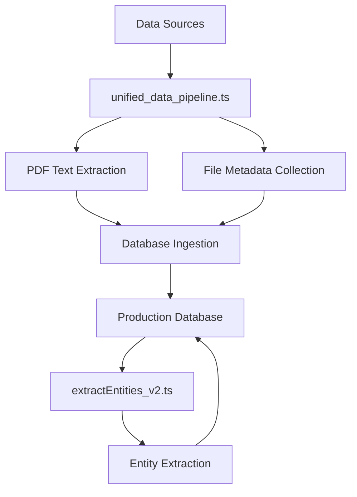

# Epstein Archive Scripts

This directory contains scripts for data processing, ingestion, and analysis for the Epstein Archive project.

## Main Ingestion Pipeline

### unified_data_pipeline.ts

**The primary data ingestion pipeline** - Use this for all document ingestion tasks.

```bash
# Run full ingestion
DB_PATH=epstein-archive-production.db npx tsx scripts/unified_data_pipeline.ts
```

**Features:**

- ✅ PDF text extraction with pdf-parse
- ✅ Support for TXT, RTF, and PDF files
- ✅ Multi-collection support (DOJ Discovery VOL001-008, Court Evidence, Maxwell Proffer, DOJ Phase 1)
- ✅ Automatic duplicate detection
- ✅ Content hashing and metadata extraction
- ✅ Progress tracking and error reporting
- ✅ Production database schema compatibility

**Collections Processed:**

- DOJ Discovery VOL00001-VOL00008
- Court Case Evidence
- Maxwell Proffer (Ghislaine Maxwell Interview Transcripts)
- DOJ Phase 1

## Entity and Relationship Processing

### extractEntities_v2.ts

Extract person names and entities from document content.

```bash
npx tsx scripts/extractEntities_v2.ts [limit] [offset]
```

## Database Migrations

SQL migration scripts are in the `migrations/` directory and should be run in order:

```bash
sqlite3 epstein-archive-production.db < scripts/migrations/001_add_entity_core_columns.sql
```

## Deployment Scripts

### verify_deployment.ts

Verify production deployment health and status.

```bash
npx tsx scripts/verify_deployment.ts
```

## Removed/Deprecated Scripts

The following scripts have been consolidated into `unified_data_pipeline.ts`:

- ❌ `ingest_unified.ts` (old ingestion script with schema issues)
- ❌ `comprehensive_ocr_ingestion.py` (Python version with dependency issues)

## Usage Examples

### Ingest all data from /data/originals

```bash
cd epstein-archive
DB_PATH=epstein-archive-production.db npx tsx scripts/unified_data_pipeline.ts
```

### Check current database stats

```bash
sqlite3 epstein-archive-production.db "SELECT source_collection, COUNT(*) FROM documents GROUP BY source_collection ORDER BY COUNT(*) DESC;"
```

### Extract entities from documents

```bash
npx tsx scripts/extractEntities_v2.ts 1000 0
```

## Architecture



## Requirements

- Node.js 20+
- TypeScript/TSX
- better-sqlite3
- pdf-parse
- glob

## Database Schema

The pipeline works with the production database schema which includes:

- `documents` table with FTS5 full-text search
- `entities` table for person/organization tracking
- `entity_mentions` for document-entity relationships
- `entity_relationships` for entity-entity connections

## Contributing

When modifying the ingestion pipeline:

1. Test with a small dataset first
2. Verify database integrity after changes
3. Update this README with new features
4. Document any schema changes in migrations/
